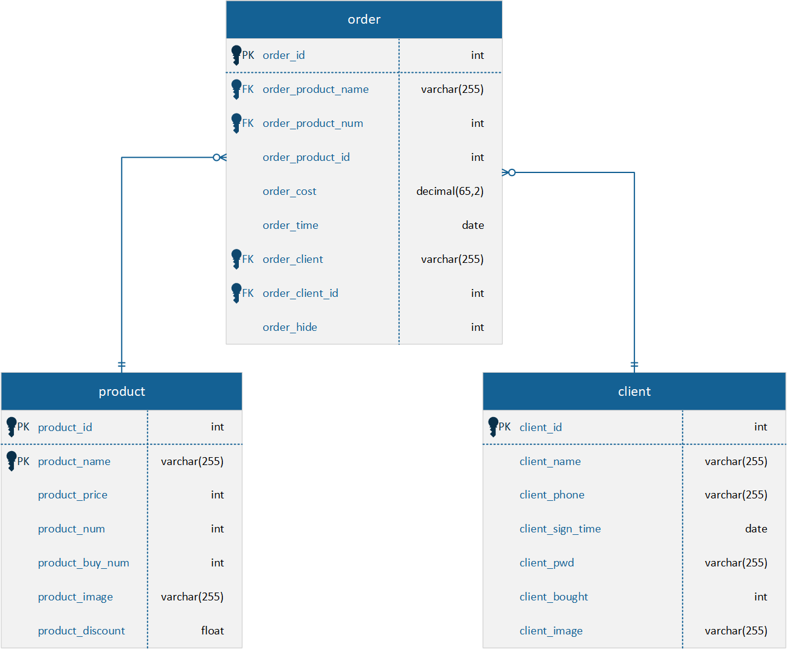
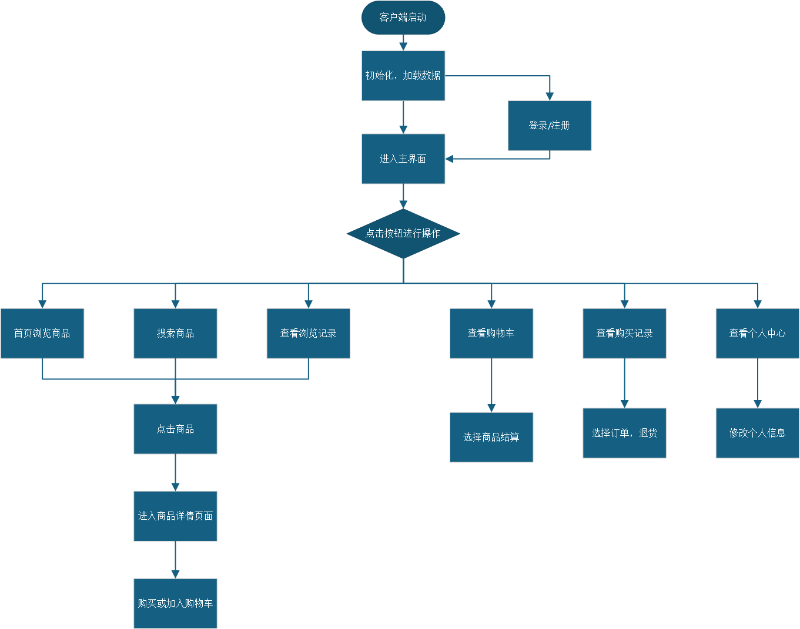
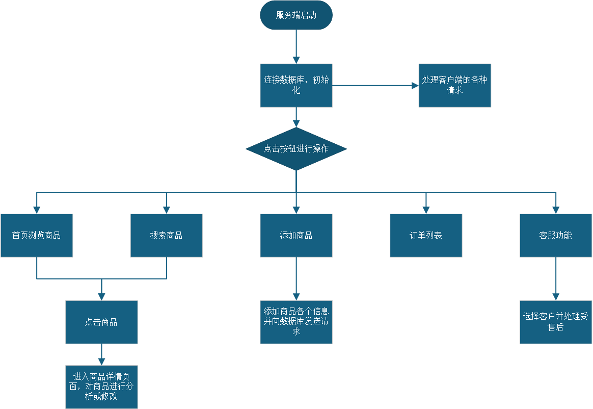
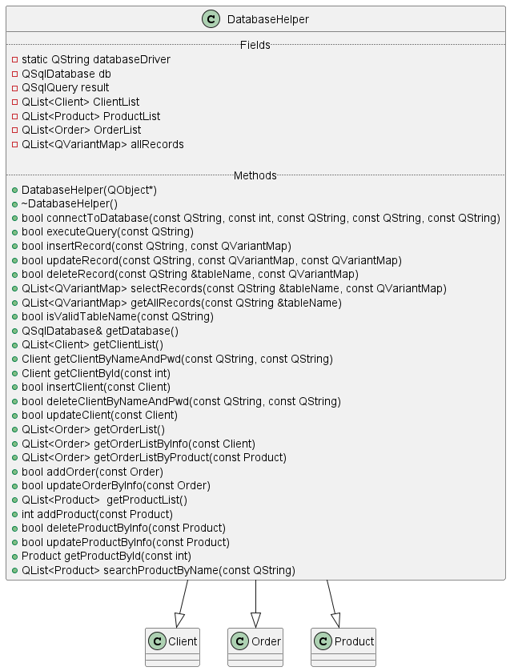
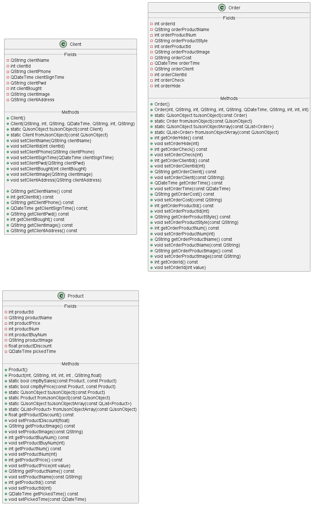
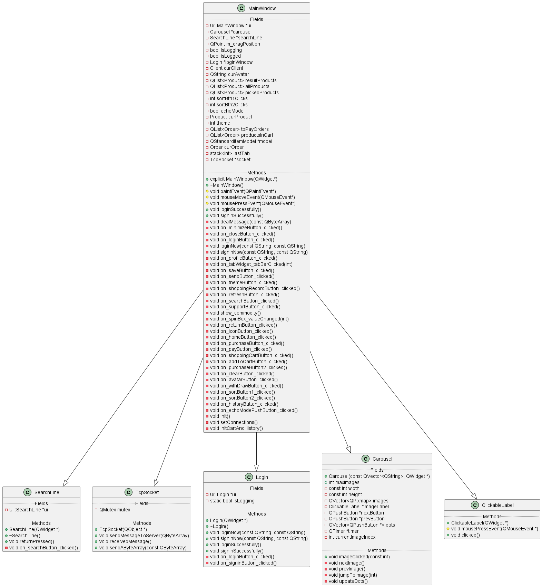
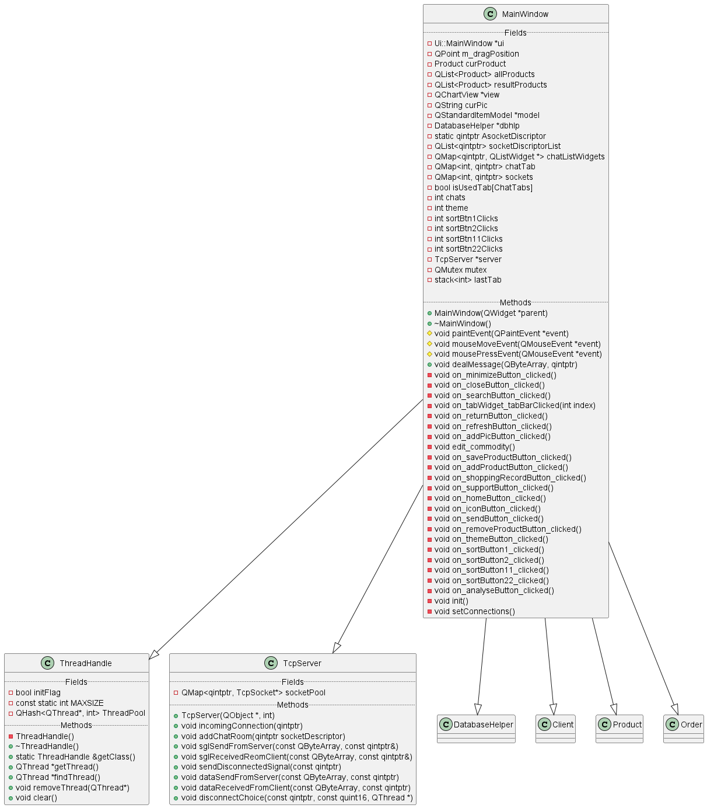

  面向对象课程设计报告  

  汤雨润  

## 一、总体设计

### 1. 客户端设计

<figure>

#### 功能需求

* **账号的注册以及登录**
  $\quad$本功能将登录和注册整合到一起，用户可在同一界面完成登陆或注册操作。点击登录按钮后，客户端会向服务端发送账号信息并进行确认。登录窗口如下图所示：
  
   
  $\quad$在注册时，$id$ 将自动分配，注册成功后，用户会进行自动登录。服务端收到账号信息后通过自定义的 $socket$ 编码识别注册信息，注册成功会自动跳转。至于其他的账号信息的修改统一放在了个人中心页面中。
  $\quad$此外，本程序不强制登录，即使没有登录账号，也可以进行一些诸如浏览商品的操作，但无法进行购买操作。
   

* **客户端界面设计**
  $\quad$首先，关于整个页面布局。应用主窗口的大小是固定的，为1000x750。窗口左侧是菜单栏，包括首页、购物车、购买记录、足迹、客服、个人中心等按钮；窗口右侧是主要界面的显示区；窗口顶部是标题栏，包括 $logo$ 、返回按钮、刷新按钮、搜索框、登录按钮、最小化按钮和关闭按钮等。如下图所示：
  
   
  $\quad$关于整个系统的界面设计语言，我坚持极简主义，用尽量少的部件达到想要的功能，使用简约的主题配色，使整个界面美观大方。我将窗口默认的标题栏隐藏，重新设计了标题栏，使应用更具一体性。
   

* **首页功能**
  $\quad$首页主要用于展示各个商品，并且筛选商品中销量前五的商品放在轮播图中展示。而轮播图下方用 $QListWidget$ 展示了其余商品。用户只需点击便能跳转到相应的商品详情界面。
  - 轮播图
    轮播图的实现主要使用 $QLabel$ 和 $QTimer$ 实现，点击左右按钮即可切换，点击下方的圆点也可切换到对应的商品。
  - $QListWidget$
    下方的 $QListWidget$ 用于展示大部分商品，主要包括了商品的图片、商品编号、商品名称、商品价格打折后的价格以及当前商品的库存。用户可上下滚动查看所有商品。
     

* **购物车功能**
  $\quad$当用户在商品页面点击加入购物车按钮后，该商品便会被加入该用户的 $productsinCart$ 列表，并展现在购物车页面。购物车中的商品会在每次程序退出时被保存下来，以便用户下次登陆时查看。如下图所示：
   
  $\quad$用户可以直接点击清空按钮将所有商品从购物车中删除；也可以选定部分商品后点击结算按钮进入支付页面。
   

* **购买记录功能**
  $\quad$在购买记录界面用户可以查看自己过往的所有订单，包括商品的售后情况。如下图所示：
  
  $\quad$订单的展示使用 $QTableView$ 结合 $QStandardModel$ 实现，用户可以通过点击表头实现对表中该数据的排序。通过点击每一行之前的复选框可以选中订单，点击下方按钮后可以实现一键退货。订单的售后状态也会更新为“已退货”。
   

* **足迹功能**
  $\quad$足迹页面中展示了用户浏览过的商品，按浏览时间先后排列，用户可以查询自己浏览过的商品。用户直接点击即可跳转到商品详情页面。如下图所示：
  
   

* **客服功能**
  $\quad$在客服界面，用户可以在下方输入框编辑消息发送给客服，服务端客服接收到消息后会给予回复。如下图所示：
  
  $\quad$消息展示主要使用 $QListWidget$ 实现，可以清晰直观地展示双方的头像、名称、消息以及发送时间。
   

* **个人中心功能**
  $\quad$个人中心页面主要展示用户的账号相关信息，并提供部分信息的修改功能。对于头像修改，用户头像实际上被放在一个名为 $avatarPushButton$ 的按钮中，当这个按钮被点击时，会跳出文件对话框使用 $QFileDialog$ 获取头像的文件路径并更新头像。对于密码的修改，用户可以点击密码框旁的按钮切换密码的显示模式。另外，只有点击下方的保存按钮后才会将修改的信息发送到数据库进行处理，出现保存成功的提示窗口后，才表明个人信息修改成功。如下图所示：
  
   

* **商品搜索功能**
  $\quad$可以对商品进行及时的模糊搜索功能。用户在搜索框输入文字后会自动展示搜索结果，即一旦搜索框内的文本改变就进行一次搜索，点击右侧搜索按钮也可进行搜索。如下图所示：
  
  $\quad$此外，页面上方的两个按钮还提供排序功能，可以按销量或者价格升序或降序排列。默认情况下，商品按照销量降序排列，当按钮被点击时，会切换排序方式。
   

* **商品详情页**
  $\quad$该页面主要展示商品的详细信息，包括商品编号、商品名称、商品价格、商品售价、商品折后价以及商品的库存。用户可以在下方选择需要购买的商品数量并选择直接购买或者加入购物车。如下图所示：
  
   

* **支付结算页面**
  $\quad$该页面用于处理直接购买或者在购物车结算产生的订单请求，详细展示了订单的信息并且要求用户填写姓名、电话和地址。默认情况下，各栏均填写用户本人的信息。如下图所示：
  
   

* 界面主题UI转换
  $\quad$用户点击右上角的主题按钮即可切换不同风格的UI界面。如下图所示：
  
   

#### 性能需求

* 应用的运行中，尽量减少不必要的对数据库的一系列操作，但同时也要保证用户获得信息的时效性，确保信息更新的速度。

</figure>

### 2.服务端设计

<figure>

#### 功能需求

$\quad$服务端的整体界面设计以及UI设计与客户端基本相同。

* **货物列表**
  $\quad$服务端的货物列表与客户端使用相同的组件进行展示，也具有按不同关键字排序的功能。
   

* **商品搜索功能**
  $\quad$服务端的搜索与客户端一样，可以实时地进行模糊搜索，及时地将搜索结果展示出来。
   

* **商品详情页**
  $\quad$在商品详情页面可以对商品进行一系列操作，可以进行更换商品照片、修改商品价格和折扣等操作。点击下方的按钮可以分别进行跳转到商品分析页面、保存商品信息和删除商品的操作。如下图所示：
  
   

* **商品图表分析功能**
  $\quad$本功能主要展示商品近 $30$ 天以来商品的销量以及退货量，以柱状图的形式呈现，更加清晰直观。商家可以基于此对商品进行分析和修改。
  
   

* **商品添加功能**
  $\quad$为了节省界面数量，添加商品的界面与商品详情页使用同一 $ui$ ，商家可以在此添加商品照片，编辑商品名称、售价和折扣，设置库存，最后点击保存即可添加商品。
  
   

* **客服功能**
  $\quad$商家可以在右侧聊天列表中选择客户回复，每一个客户登陆成功后都会被添加到聊天列表，退出时自动被删除。如下图所示：
  
   

#### 性能需求
$\quad$在考虑到秒杀功能的实现时，可能会遇到每个用户端多次申请同请求，且多个用户同时申请，若使用单线程，则会产生速度过慢而导致的多服务器卡死问题，因此在此基础上我们需要多线程的帮助，才能在高并发模式下，提高信息接收的速率。
$\quad$本程序在异步 $socket$ 连接上采用了多线程的处理方式，并考虑到了高性能的问题，即每一个 $socket$ 分配一个线程，在此条件下，多个 $socket$ 将产生多个线程，且线程内部实质性工作在大部分时刻都处于空闲状态，因此过多的线程运行会导致主机的内存占用比升高，带不动更多的服务器，因此本程序采用了线程管理的方式，将线程集中起来管理，形成线程池，负责控制线程的产生和释放，且一个线程负责控制多个 $socket$ 的运行，即防止了多线程产生的高性能问题，也进一步实现了高并发。

</figure>

### 3.数据库设计

<figure>

$\quad$本程序的数据库 $ecommerce$ 包含了三个表： $client$ 、 $product$ 、 $order$ 。其中有部分信息具有关联型，即含有外键，每个表下具有不同的属性和功能，包括了用户、商品和销售记录四种类型。整个数据库的表以及表之间的关系如下图所示：

$\quad$在 $client$ 表中，设置 $client_id$ 作为主键，其中 $client_id$ 保持数据库内部自增，在删除特定 $id$ 的对象后，不会有重复的 $id$ 继续生成。且该表中存在必须填写的项目：如姓名和密码是必须填写的，其他选填。
$\quad$在 $product$ 表中，设置 $product_id$ 作为主键，不可重复，且保持自增，其他属性中：名称，价格，为不可缺少的属性，其他属性可以选填。
$\quad$在 $order$ 表中，其属性较多，且将 $client$ 表， $product$ 表中的属性作为外键，遵循当货物与顾客被删除时，存在 $order$ 的顾客与货物 $id$ 置空的操作，其中所有的属性均为非空。

</figure>

### 4.流程设计

<figure>

#### 客户端流程

 

#### 服务端流程

 

</figure>

### 5.类设计以及类之间关系

#### 持久层类与接口之间的关系:

<figure>

$\quad$本程序使用 $ODBC$ 作为数据库驱动器，使用 $QSql$ 等数据库相关的库实现持久层。类与接口关系如下图：

</figure>

#### 简单普通类:

<figure>

</figure>

#### 客户端的类及类间关系:

<figure>

</figure>

#### 服务端的类及类间关系:

<figure>

</figure>

 

## 二、系统实现

### 基于 Qt 框架的 C++可视化编程

<figure>

$\quad$本程序的所有可视化窗口均为基于 $Qt$ 框架的编程，使用 $Qt6.7$ 套件，涉及了 $Qt$ 中 $QWidget$ 的各种变换，数据传递，界面设计，控件设计。具体包括：
* $UI$ 可视化设计
* 信号与槽机制的使用
* $Qt$ 容器的使用，和 $Qt$ 小控件的使用
* $QString$ 的常用功能
* $Qt$ 的布局的使用
* $TabWidget$ 的使用
* $Model$ 和 $View$ 的使用
* 多窗体应用程序的设计
* $QCharts$ 的使用
* 常见的柱状图
* $Qt$ 中的异步 $socket$ 的使用
* $Qt$ 中 $TcpServer$ 的使用

</figure>

 

### 数据传输

<figure>

$\quad$为了提高信息传输效率并降低编程难度，本程序在传输数据时使用 $QJsonObject$ 及相关库封装信息，以提高编程效率。

</figure>

### 高并发问题的解决

<figure>
$\quad$本程序使用了线程分配管理操作，创建了线程管理类，该管理类将会动态管理线程。假定每一条线程最多管理三个 $socket$ 可以保持优良的通讯并发情况，因此在初始子线程已经达到管理上限时，再次主动在堆区创建线程，并将之后的 $socket$ 移入该线程进行处理，并且对每一个线程进行计数，每次分配 $socket$ 时，永远将 $socket$ 管理数最小的线程作为第一分配对象，让该线程管理即将到来的 $socket$ 。在有 $socket$ 断开连接时，可以自动识别 $socket$ 断开连接，将某一线程的管理数进行改变，便于之后的判断。

 

</figure>

### 持久层的实现

<figure>
$\quad$本程序使用 $Qt$ 自带的 $QSql$ 等库和 $ODBC$ 数据库驱动器实现持久层。对每个表的增删改查都进行了封装，并且保证了数据库的可扩展性，便于以后增加更加复杂的功能。所有对数据库的操作统一交由一个 $DatabaseHelper$ 对象来进行，提高了编程效率，降低了程序维护难度。

 

</figure>

## 三、未完成的模块

* 原计划在客服中引入大语言模型辅助商家进行售后服务，即 $AI$ 客服功能，但由于时间有限且没太弄明白该如何调用而放弃。
* 本程序中的打折功能较为草率，商家只能对商品单一操作，没有促销活动这样的功能。
* 本程序中客户的地址并未保存到数据库，而是本地保存，使得异地登陆会造成使用不便，需要改进。
* 本程序中的客户端没有退出账号功能，只能关闭客户端方可退出。
* 原计划把客服聊天界面做成气泡聊天，但是一直没调试好，遂放弃。
* 原计划服务端对商品的数据统计功能应当更加丰富，但精力有限只完成了销量柱状图。